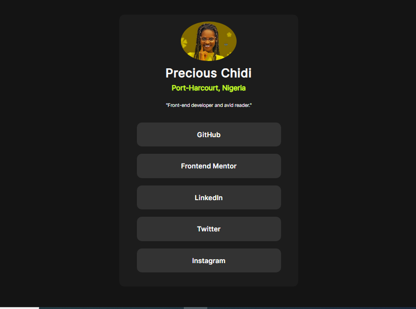

# Frontend Mentor - Social Links Profile solution

This is a solution to the [Social links profile challenge on Frontend Mentor](https://www.frontendmentor.io/challenges/social-links-profile-UG32l9m6dQ). Frontend Mentor challenges help you improve your coding skills by building realistic projects.  

## Table of contents

- [Overview](#overview)
  - [The challenge](#the-challenge)
  - [Screenshot](#screenshot)
  - [Links](#links)
  - [Built with](#built-with)
  - [What I learned](#what-i-learned)
  - [Continued development](#continued-development)
  - [Useful resources](#useful-resources)
- [Author](#author)

## Overview

### The challenge
The challenge is to build out this Social Link Profile and get it looking as close to the design as possible.

Users should be able to:

- See hover and focus states for all interactive elements on the page

### Screenshot

### Links

- Solution URL: [Add solution URL here](https://github.com/peechidi/social-link-profile)
- Live Site URL: [Add live site URL here](https://peechidi.github.io/social-link-profile/)

### Built with

- Semantic HTML5 markup
- CSS custom properties
- Flexbox
- CSS Grid
- Mobile-first workflow
- CSS Variable

### What I learned

I learnt how to use CSS Variable
I learnt how to proper position elements
I learnt to customize a font family using the @font-face style

### Continued development

Grid
size measurement

### Useful resources

 
- (https://www.chatgpt.com) - This is an amazing AI tool which helped me to get quick and rich answers

## Author

- Website - (https://peechidi.hashnode.dev/)
- Frontend Mentor - (https://www.frontendmentor.io/profile/peechidi)
- Twitter - (https://www.twitter.com/kukan_pee)
- Linkedin - (www.linkedin.com/in/precious-chidi-obinichi-296a9014b)

